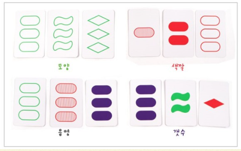
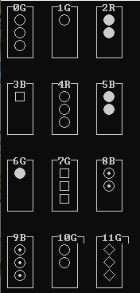

# 보드게임 Set

## Set 룰

Set에는 4가지 속성이 3개씩 존재한다. 아래 그림을 보면 이해가 쉽다.

여기서 속성이 모두 같거나 다른 카드 3개를 set라고 한다.

콘솔창으로 카드를 표현할때 색까지 표현하기엔 부족해서 일단 문자로 대체했다.

* 예시 : 0번, 1번, 10번은 set이다
    * 전부 동그라미이며
    * 색상과 음영도 모두 같고
    * 갯수는 모두 다르다

* 예시: 4번 6번 8번은 set 이다
    * 전부 동그라미
    * 갯수는 모두 다르며
    * 색상도 R,G,B로 다르고
    * 음영도 모두 다르다.

이게 룰이며, 게임 진행방식으로 콘솔창에 카드번호를 입력하면 된다.
